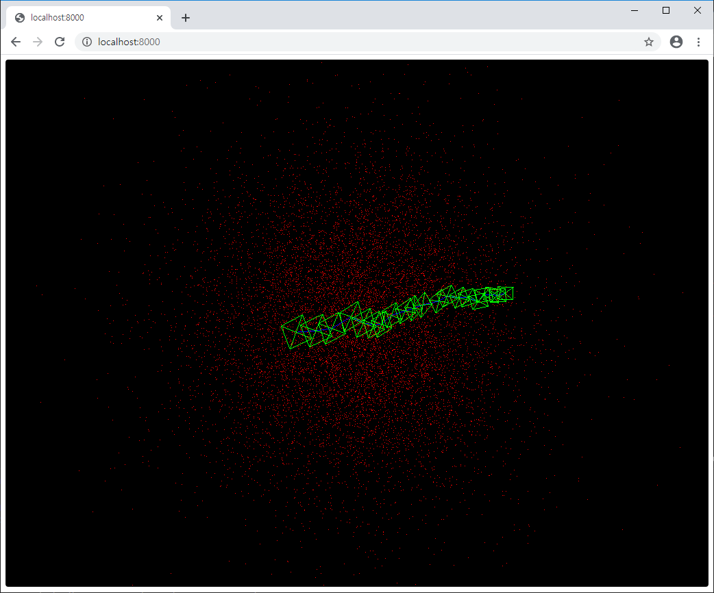

# SLAM Viewer



Simple [wgpu](https://github.com/gfx-rs/wgpu-rs) based SLAM map viewer.

## Current Working

* [x] Draw points
* [ ] Mouse control
* [ ] Draw frames
* [ ] Draw input images
* [ ] UI (Buttons, ...)

## Usage

Add this to your `Cargo.toml`:

```toml
[dependencies]
slam-cv = "0.1"
slam-viewer = "0.1"
```

If you are new to [slam-cv](https://github.com/podo-os/slam-cv), enter this command simply at your prompt:

```sh
cargo run --example simple
```

If you have your own `World`, add this to your `main.rs`:

```rust
fn main() {
    let world = MyWorld(..);

    slam_viewer::alloc_thread().add_world(world).run();
}
```
