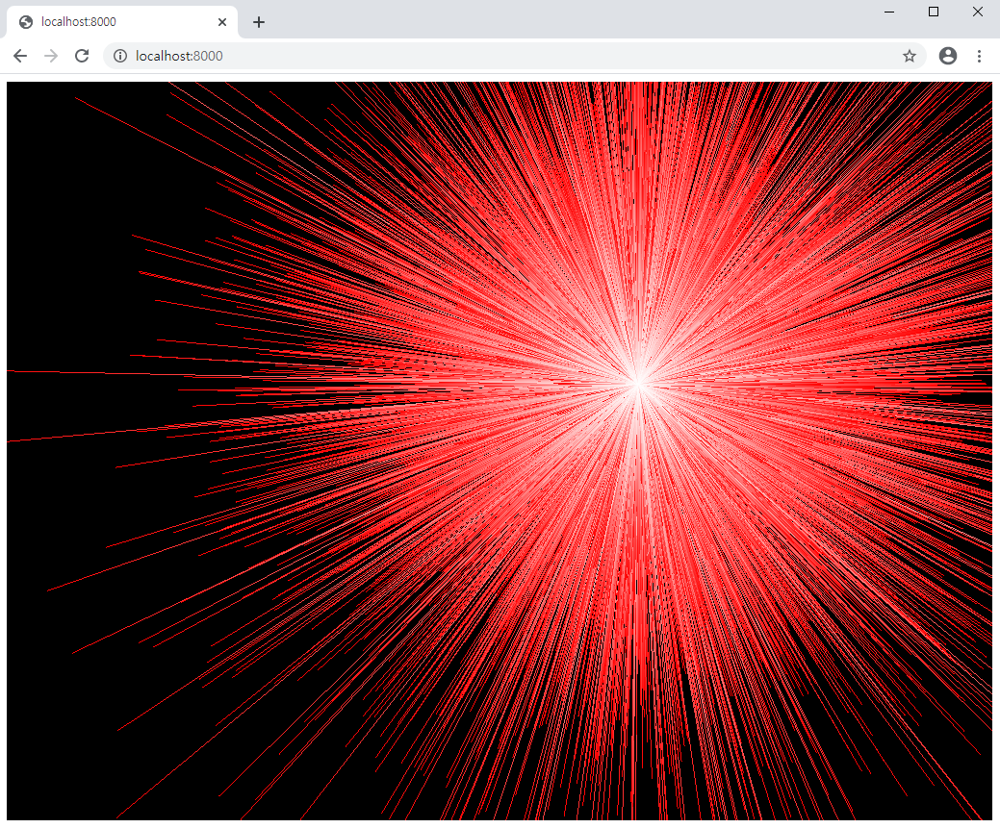

# SLAM Viewer



Simple [wgpu](https://github.com/gfx-rs/wgpu-rs) based SLAM map viewer.

## Current Working

* [x] Draw points
* [x] Mouse control
* [x] Draw frames
* [ ] Draw input images
* [ ] UI (Buttons, ...)

## Usage

Add this to your `Cargo.toml`:

```toml
[dependencies]
slam-cv = "0.1"
slam-viewer = "0.1"
```

If you are new to [slam-cv](https://github.com/podo-os/slam-cv), enter this command simply at your prompt:

```sh
git clone https://github.com/podo-os/slam-viewer
cd slam-viewer
cargo run --example simple
```

If you have your own `World`, add this to your `main.rs`:

```rust
fn main() {
    let world = MyWorld(..);

    slam_viewer::alloc_thread().add(world).run();
}
```

### Run Examples on the Web (`wasm32-unknown-unknown`)

The manual is taken from `wgpu-rs`.
Note that running on the web is quite unstable and only available in `Windows`.
For more information, please visit [the official `wgpu-rs` repository](https://github.com/gfx-rs/wgpu-rs).

To run examples on the `wasm32-unknown-unknown` target, first build the example as usual, then run `wasm-bindgen`:

```bash
# Install or update wasm-bindgen-cli
cargo install -f wasm-bindgen-cli
# Build with the wasm target
RUSTFLAGS=--cfg=web_sys_unstable_apis cargo build --target wasm32-unknown-unknown --example simple
# Generate bindings in a `target/generated` directory
wasm-bindgen --out-dir target/generated --web target/wasm32-unknown-unknown/debug/examples/simple.wasm
```

Create an `index.html` file into `target/generated` directory and add the following code:

```html
<html>
  <head>
    <meta charset="UTF-8">
    <meta name="viewport" content="width=device-width, initial-scale=1.0">
  </head>
  <body>
    <script type="module">
      // disable right-click menu
      document.addEventListener('contextmenu', event => event.preventDefault());
      // load viewer
      import init from "./simple.js";
      init();
    </script>
  </body>
</html>
```

Now run a web server locally inside the `target/generated` directory to see the `simple` in the browser.
e.g. `python -m http.server`

## Reference

* `wgpu` tutorial: https://sotrh.github.io/learn-wgpu/
* `kiss` 3d graphics engine: https://github.com/sebcrozet/kiss3d
